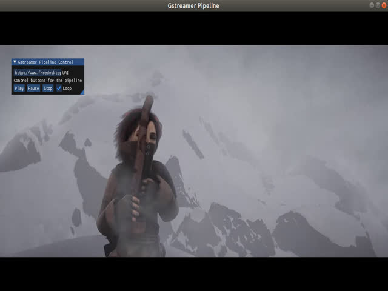

# imgui_gstreamer
This is a simple gstreamer video player integrated with Dear ImGui. The example is built with opengl3 & glfw as backend. Only supports linux as of now.

## Steps to build

1. Install all Dear Imgui and Gstreamer dependencies
1. Update IMGUI_DIR in Makefile to Dear imgui source folder.
1. Run `make -j`